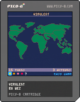

# Virulent

Virulent is a turn-based tactical game where you are in charge of managing a global viral outbreak, and if you are lucky, save the world.

I dedicate this game to every person who has been separated from their family or loved ones during the tragic corona virus outbreak of 2020. We miss you dearly.

# Get It

A LÖVE package, and a Windows build is available on the [releases page](https://github.com/wesleywerner/virulent/releases).

The Pico-8 version is available as a cartridge, below. You need a copy of the Pico-8 fantasy console to load this cartridge.

If you don't have a Pico-8 console, you can play the online [web version](https://www.lexaloffle.com/bbs/?tid=39153).

# Game Instructions

Virulent is a turn-based game where you use action points to manage a viral outbreak on earth. The story is that the earth is hit by asteroids carrying a deadly virus, your task is to launch missiles to prevent any more infections, while administering remedies to infected countries and cure them.

### Mute

Press `control` + `m` to mute/unmute audio.

### Full screen

Press `alt` + `return` to toggle full screen.

### Controls

To highlight a country, choose a remedy or select an asteroid:

`up`, `down`, `left`, `right` arrow keys.

### Actions

To open country details or press a toolbar button:

Press the `X` key.

### Shortcut key

Press the `Z` key.

On all screens you can use the `Z` key as a shortcut instead of using the toolbar.

- On the Regional screen, it opens the remedy screen if a remedy can be applied.
- On the Remedy screen, it applies the selected remedy.
- On the Radar screen, it launches a missile.
- On the Command screen, it ends the turn (only when no more actions can be performed).

### The Toolbar

The toolbar is located at the bottom of the screen. Use the arrow keys to highlight a button, and `X` to press it.

On the Command Station screen, press the `down` key to focus the toolbar at the bottom. To return to country selection, press the `up` key.

Instructions are in-game. Choose the Help toolbar icon to read them.

# History

Virulent is a remake of an Atari game called "Epidemic!" by Steven Faber (1982).

I started the project in July 2020 for the [Pico-8](https://www.lexaloffle.com/pico-8.php) fantasy console. It took 4 weekends to complete. I referenced the [original game manual](http://www.atarimania.com/game-atari-400-800-xl-xe-epidemic_1859.html) to derive the game mechanics. I updated the world data to reflect modern country names and statistics, and added three new countries - Madagascar, Southeast Asia and South Africa.

If you would like to play the original game by Steven Faber, you can find the Atari version from [myabandonware.com](https://www.myabandonware.com/game/epidemic-26#Atari%208-bit) and use an emulator like [atari800](https://atari800.github.io). The DOS version is not playable, in my opinion.

> Signed, Wez

# Thanks

Thanks to RhythmLynx for using their [Pico-8 Font](https://www.lexaloffle.com/bbs/?tid=3760) in the LÖVE version.

# License

See [COPYING](COPYING)
